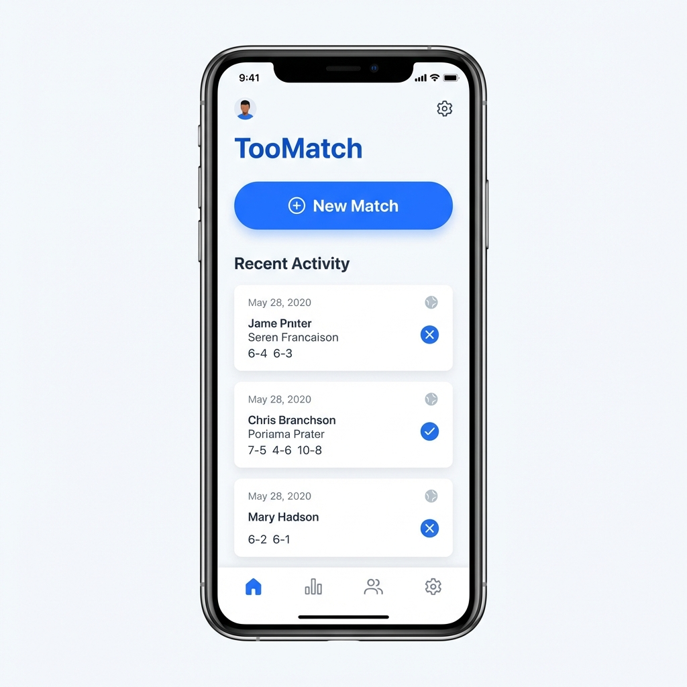
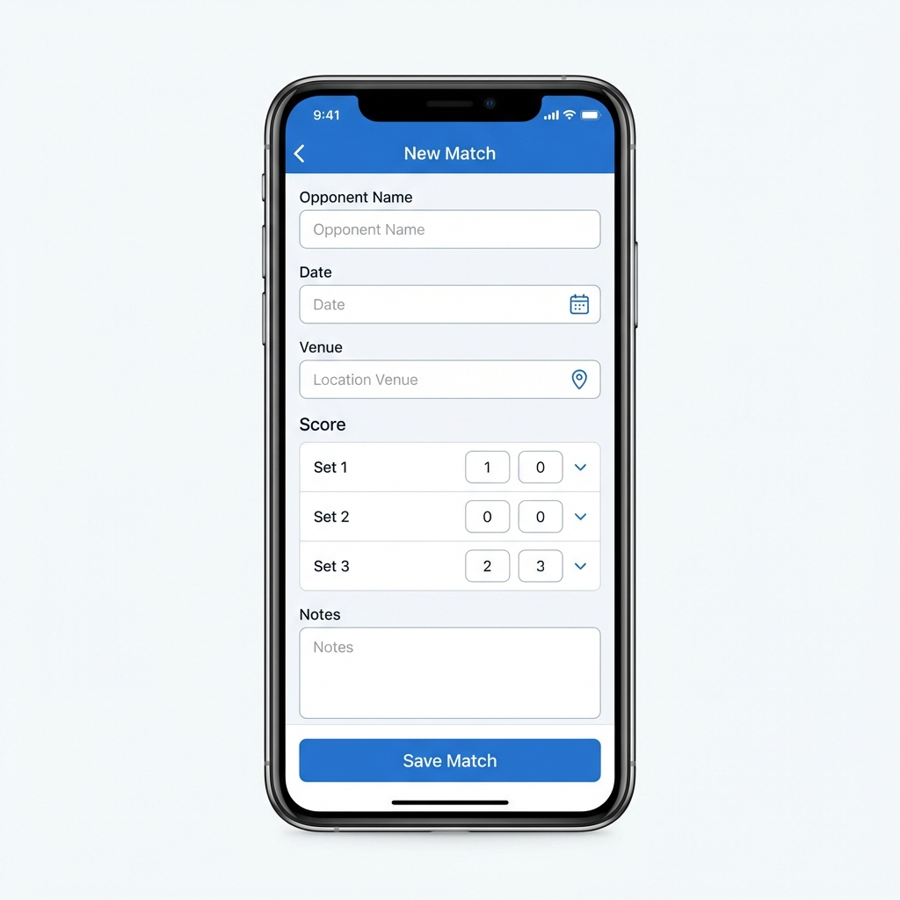

# Roadmap e TODO

## Funzionalità Pianificate / Idee
- [ ] **Miglioramento UI**: Implementazione di un design più curato per la home e i dettagli match.
- [ ] **Statistiche**: Visualizzazione avanzata delle statistiche di gioco (vittorie/sconfitte, punteggi medi, ecc.).
- [ ] **Creazione Match Reale**: Form per inserire i dati reali di un match invece di usare dati di test.
- [ ] **Internazionalizzazione**: Supporto completo lingua Italiana (in corso).

## Bozzetti Grafici (Proposte)

### 1. Home Screen (Dashboard)

*Concept per la Home con tasto "New Match" in evidenza e ultime attività.*

### 2. Nuovo Match

*Concept per la schermata di inserimento nuovo match.*
👉 **[Visualizza Mockup Interattivo (HTML)](./mockups/new_match_mockup.html)**

### 3. Lista Match e Statistiche
*(Immagini non disponibili al momento - vedi descrizioni nel piano di implementazione)*
